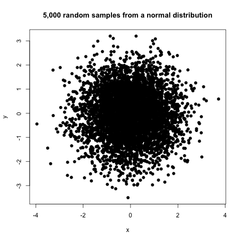
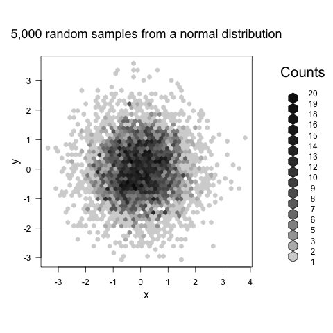
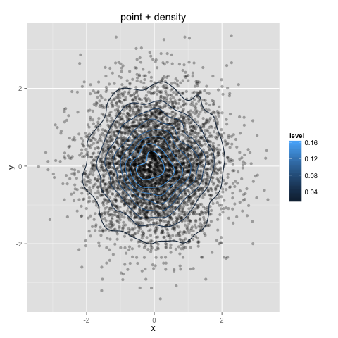

% Interfacing R and Python using Rpy2
% Matt Shirley (matt.shirley@jhmi.edu)
% 02 May 2013

```{r setup, include=FALSE}
opts_chunk$set(engine = 'python')
```

# Installing [Rpy2](http://rpy.sourceforge.net/rpy2.html)

You'll need `R > 2.15`, as well as `Python > 2.7`. If you have trouble calling `R` from
`Rpy2`, you might need to compile `R` yourself using `--enable-R-shlib`. If you have no idea
what this means [read this](http://rpy.sourceforge.net/rpy_faq.html).

- Linux or MacOS
    - `easy_install rpy2` or `pip install rpy2`
- Windows
    - See this [post on Stack Overflow](http://stackoverflow.com/questions/4750806/how-to-install-pip-on-windows) if you want to use `pip` yourself
	- If you just want a recent version of Rpy2 and are on Windows, install [from Chris Gohlke](http://www.lfd.uci.edu/~gohlke/pythonlibs/#rpy2)
	- Alternatively, install a very old version of [rpy2](http://sourceforge.net/projects/rpy/files/rpy2/2.0.x/) if you are using Python 2.6 or older

# What is Rpy2?

`Rpy2` is a Python interface to the [R statistical programming language](http://www.r-project.org). Many of
Python's core strengths (readable code, flexible I/O, design philosophy)
complement R's core strengths (strong statistical heritage, powerful graphics).

- Sometimes it just makes sense to create your plots using R's graphics engine
- You could achieve this by writing data from your Python script to a file,
making a system call to R, and having the R script read the data and create a plot.
- However, it would be better to stay "inside" of Python, but still call functions
in R.

# A (very) simple example

```{r simple}
import rpy2.robjects as robjects
r = robjects.r

x = robjects.IntVector([1, 2, 3])
y = robjects.IntVector([4, 5, 6])
z = x + y
print z
z_mean = r.mean(z)
print z_mean
```

We import the parts of R that we need, and then call our R code as Python functions.

# A statistics example

```{r sample}
import rpy2.robjects as robjects
from rpy2.robjects.packages import importr
gd = importr('grDevices')

r = robjects.r
x = r.rnorm(5000)
y = r.sample(x, replace=True, size=5000)
gd.png(file="figure1.png")
r.plot(x, y, ylab="y", xlab="x", pch=19)
r.title("5,000 random samples from a normal distribution")
gd.dev_off()
```



These points are kind of over-plotted. Let's see what we can do about that.

# Importing another R package (hexbin)

```{r sampleHex}
import rpy2.robjects as robjects
from rpy2.robjects.packages import importr
gd = importr('grDevices')
hb = importr('hexbin')

r = robjects.r
x = r.rnorm(5000)
y = r.sample(x, replace=True, size=5000)
bin=hb.hexbin(x, y, xbins=50)
gd.png(file="figure2.png")
r.plot(bin, ylab="y", xlab="x", \
       main="5,000 random samples from a normal distribution")
gd.dev_off()
```



Binning the data by proximity, we can now see the pattern of density
at the center of the scatter-plot.

# Plotting using ggplot2

Adapted from [Rpy2 documentation](http://rpy.sourceforge.net/rpy2/doc-2.3/html/graphics.html#package-ggplot2)
```{r ggplot2}
import rpy2.robjects.lib.ggplot2 as ggplot2
import rpy2.robjects as ro
from rpy2.robjects.packages import importr
gd = importr('grDevices')
stats = importr('stats')
x = ro.r.rnorm(5000)
y = ro.r.sample(x, replace=True, size=5000)
rnorm = stats.rnorm
dataf_rnorm = ro.DataFrame({'x': x, 'y': y})
gd.png(file="figure3.png")
gp = ggplot2.ggplot(dataf_rnorm)
pp = gp + \
     ggplot2.aes_string(x='x', y='y') + \
	 ggplot2.geom_point(alpha = 0.3) + \
	 ggplot2.geom_density2d(ggplot2.aes_string(col = '..level..')) + \
	 ggplot2.ggtitle('point + density')
pp.plot()
gd.dev_off()
```



# Converting to a python object

```{r simple2}
import rpy2.robjects as robjects
import numpy
r = robjects.r

z = r.rnorm(10)
print z
zz = numpy.array(z)
print zz
print zz.mean()
```

We can process our data in R, and then move the data back to a
Python data structure for further computations.

# Summary

You can write the parts of your program in a language appropriate for
the task. Highlights of R include:

- Access to the [CRAN](http://cran.r-project.org) and [bioconductor](http://www.bioconductor.org)
software repositories
- Robust statistical analyses (SVD, PCA, linear regression, ANOVA) built in to the base
`stats` library
- A knowledgeable community and [established mailing list](https://stat.ethz.ch/mailman/listinfo/r-help)

# Questions?

If you have any questions, feel free to email me at matt.shirley@jhmi.edu


[Source](http://www.qwantz.com/index.php?comic=2406)
